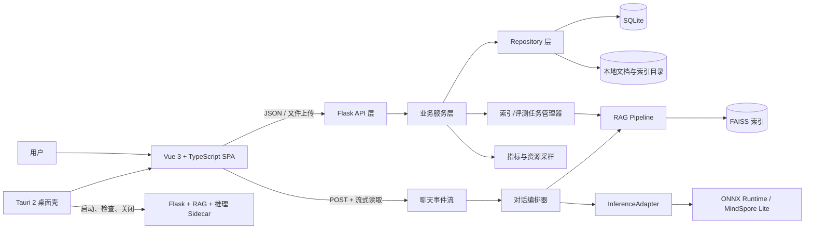

# 面向边缘计算的轻量级知识增强办公对话系统——前后端开发详细方案

> 方案版本：V2.2  
> 首次编制：2026-07-15  
> 本次审查修订：2026-07-17  
> 依据材料：`立项申请.txt`  
> 适用范围：前端应用、Flask 后端、轻量 RAG、模型推理集成、Windows/macOS/Linux 桌面演示应用，以及后续移动端适配

本次修订重点：补充系统边界、启动前提、模型与索引制品契约、RAG 评测指标、整体内存分配、备份回滚、CI 质量门禁、任务依赖、带日期的执行计划，以及受控小模型办公 Agent 的能力边界、架构、安全策略与评测方案。

## 1. 方案结论
中文名：知微智办
英文名：KnowLite Office
本项目应建设一个前端、业务后端、RAG 与推理运行时协同工作的完整系统，而不是只实现一个“聊天框”。系统需要同时证明四件事：

1. 轻量模型能在普通 PC 的本地环境稳定运行；
2. 回答由本地知识库增强，并且证据来源可追溯；
3. 蒸馏、量化、RAG 对延迟、内存和回答质量的影响可被量化展示；
4. 系统断网后仍可完成核心办公问答，满足隐私敏感场景需求。

因此，推荐按“一套业务内核、两种运行形态、前后端契约先行”的路线开发：

- 第一阶段同步建设 Vue 响应式 SPA、Flask API、SQLite 持久化、FAISS 知识库和统一推理适配层；
- 第二阶段完成模型、RAG、接口和前端的端到端联调，形成可独立运行的 Web 演示版本；
- 第三阶段复用同一套前后端业务，通过 Tauri 2 打包桌面应用，并将 Flask、RAG 与推理服务作为本地 sidecar 启动；
- 移动端本期只保证核心聊天能力的响应式适配，不承诺完整的本地模型打包，以控制项目风险。

推荐技术栈：前端采用 `Vue 3 + TypeScript + Vite + Vue Router + Pinia + ECharts`，后端采用 `Python + Flask + SQLAlchemy + SQLite + FAISS`，模型通过统一 `InferenceAdapter` 接入 `ONNX Runtime / MindSpore Lite / 其他推理引擎`，桌面端采用 `Tauri 2`。聊天流式响应使用 `fetch + ReadableStream`；单向 token 流不需要引入 WebSocket。

## 2. 对立项申请的系统解读

### 2.1 项目目标到前后端能力的映射

| 立项目标 | 前端职责 | 后端职责 | 可见验收证据 |
|---|---|---|---|
| 日常办公智能对话 | 多轮会话、流式展示、停止/重试、复制与导出 | 会话持久化、提示组装、生成流、请求取消 | 可完成制度查询、摘要、改写等演示任务 |
| 轻量模型边缘部署 | 展示本地服务、模型、设备和离线状态 | 模型加载、推理引擎适配、资源采样和健康检查 | 页面显示运行位置、量化类型和真实资源占用 |
| 精准化 RAG | 知识库选择、检索阶段反馈、引用与证据查看 | 文档解析、切分、嵌入、FAISS 检索、重排与引用提取 | `[1]` 可定位到文件、页码/段落和原句 |
| 降低幻觉 | 无证据与低置信度提示、用户反馈 | 相似度阈值、证据约束提示、引用一致性校验 | 无可靠证据时不伪造来源并明确提示 |
| 响应延迟 <500ms | 采集并展示 TTFT、总耗时和生成速度 | 对检索、提示组装、首 token 和生成过程分段计时 | 每轮回答带可复核性能明细 |
| 内存 <1GB | 性能看板与实验导出 | 采集整个进程树 RSS、CPU 和模型占用 | 显示当前值、峰值及原始采样数据 |
| 蒸馏前后性能比较 | A/B 参数配置、结果和图表 | 评测任务执行、指标计算、实验配置持久化 | 参数量、质量、TTFT、吞吐、内存对比 |
| 可交互应用原型 | Web/桌面界面、异常恢复 | API、存储、sidecar 生命周期和数据迁移 | Windows 优先形成可独立启动的演示程序 |

### 2.2 必须澄清的指标口径

申请书中的“响应延迟 <500ms”不能直接等同于长回答全部生成完成。前端展示、后端埋点和实验报告统一拆成以下指标，避免答辩时口径不清：

- `TTFT`：用户提交到首 token 到达，目标 `<500ms`，这是优先验收指标；
- `Retrieval latency`：向量检索、重排和引用提取耗时；
- `Generation latency`：首 token 到最后 token 的耗时；
- `End-to-end latency`：提交到回答完成的总耗时；
- `Throughput`：生成速度，单位 `tokens/s`；
- `Peak RSS`：整个本地应用运行期间的峰值常驻内存，而不只统计模型权重。

如当前算法无法达到 `<500ms TTFT`，后端应返回真实测量值，前端据实展示，不得硬编码达标状态。研究型项目中，真实可复现的对比结果比伪造“绿灯”更有说服力。

### 2.3 系统边界与启动假设

本方案将“模型训练研究”和“可交互应用运行时”明确分开：

| 范围 | 本方案是否负责 | 交付边界 |
|---|---|---|
| 蒸馏训练、DPO、量化实验脚本 | 不属于前后端运行时，但需协同 | 算法组交付可加载模型包、配置、校验值和基准结果 |
| 模型加载与推理 | 是 | 后端通过 `InferenceAdapter` 加载算法制品并提供流式事件 |
| 文档导入与 RAG | 是 | 从原始文档到引用证据形成完整闭环 |
| Web/桌面交互 | 是 | 同一 Vue 应用支持浏览器和 Tauri |
| 多用户、账户与云同步 | P0/P1 否 | 本期按单机、单用户、离线优先设计 |
| 移动端本地推理 | P2 | 不阻塞 Windows x64 主要演示交付 |

计划成立需要以下前置条件：

1. 主要目标设备确定为 Windows 11 x64 普通 PC，并在第 1 周登记 CPU、内存和可用推理后端；
2. 算法组最晚在第 3 周提供一个能输出 token 流的模型样例，第 5 周前提供候选量化模型包；
3. 第 1 周准备不少于 20 份可合法用于演示的办公文档，以及至少 70 条评测问题（不少于 50 条可回答、20 条无答案）；
4. P0 文档格式冻结为 `TXT / Markdown / PDF`，`DOCX` 验证通过后进入 P1；
5. P0 只支持一个前台生成请求、一个后台索引或评测任务，不承诺多用户并发；
6. 本计划按 2026-07-20 开始执行估算；若模型、设备或数据集未按时到位，里程碑日期按依赖延迟等量顺延。

## 3. 产品定位与用户

### 3.1 核心用户

| 用户 | 主要诉求 | 系统侧重点 |
|---|---|---|
| 普通办公用户 | 用自然语言查询本地资料，结果可信、操作简单 | 对话、引用、文件导入、隐私与离线提示 |
| 项目研发成员 | 调整检索参数，定位模型/RAG 问题 | 调试信息、运行日志、模型与检索配置 |
| 指导教师/答辩评委 | 快速理解创新点并看到量化成果 | 对比实验、性能看板、可复现导出 |

### 3.2 典型使用场景

1. 用户导入学校制度、项目材料或办公文档，系统完成切分和索引；
2. 用户提问“项目中期检查需要准备哪些材料”；
3. 页面先显示“正在检索本地知识库”，再流式生成回答；
4. 回答携带可点击引用，右侧证据面板展示最相关的 1–2 个句子；
5. 用户查看本轮 TTFT、检索耗时、tokens/s 与内存峰值；
6. 研发人员切换“学生模型 / 学生模型 + RAG”并运行相同问题，生成对比结果；
7. 用户断开网络后再次提问，核心流程仍可用。

## 4. 开发范围与优先级

### 4.1 P0：必须完成的最小可演示版本

- Flask 应用工厂、配置分层、统一错误响应和健康检查；
- SQLite 会话/消息/文档/任务持久化及数据库迁移；
- 本地模型统一推理适配器，支持加载、流式生成、取消和状态查询；
- 文档解析、切分、嵌入、FAISS 索引、检索、引用提取的 RAG 闭环；
- 系统首次启动引导与本地服务检查；
- 多轮对话、会话新建/重命名/删除；
- 流式回答、停止生成、重新生成、复制回答；
- Markdown、安全代码块和表格渲染；
- TXT/Markdown/PDF 文件上传、索引进度、列表、删除与重建；
- 回答引用标记与证据片段查看；
- 当前模型、量化类型、本地/离线状态展示；
- 单轮性能指标：TTFT、总耗时、检索耗时、tokens/s；
- 完整的加载、空数据、断连、超时、推理失败状态；
- OpenAPI 契约、结构化日志、核心后端单元测试；
- Web 构建产物和 Windows 桌面演示包。

### 4.2 P1：支撑科研验证的增强版本

- 检索重排、索引增量更新和失败任务恢复；
- 评测任务执行器、实验配置快照和指标聚合；
- 多推理引擎/多量化模型适配；
- 模型/RAG 组合对比实验；
- CPU、内存的历史趋势图；
- 测试集批量运行、进度与结果表；
- 实验结果导出 JSON/CSV；
- 会话导出 Markdown；
- 检索参数配置：Top K、重排数量、最大证据句数；
- 暗色模式、字号切换与快捷键；
- macOS/Linux 打包验证。

### 4.3 P2：本期不作为承诺的扩展项

- 语音输入与语音播报；
- OCR、图片理解、多模态问答；
- 多用户、登录、云同步；
- 插件市场和复杂工作流编排；
- 全功能移动端本地推理；
- 在线自动更新。

P2 只能在 P0、P1 稳定后实施，不能挤占核心研究展示所需时间。

## 5. 信息架构

```text
应用
├─ 首次启动 / 环境检查
├─ 智能对话（默认首页）
│  ├─ 会话历史
│  ├─ 消息流与生成状态
│  ├─ 知识库选择
│  └─ 引用证据与本轮性能
├─ 知识库
│  ├─ 知识库列表
│  ├─ 文档导入与索引任务
│  └─ 文档切片/证据预览
├─ 实验中心
│  ├─ 单题 A/B 对比
│  ├─ 批量评测
│  └─ 性能与准确率报告
├─ 系统状态
│  ├─ 模型与运行设备
│  ├─ CPU/内存/延迟监控
│  └─ 本地服务日志
└─ 设置
   ├─ 模型与推理
   ├─ RAG 参数
   ├─ 外观与存储
   └─ 关于项目
```

主导航保持 4 个一级入口：`对话`、`知识库`、`实验中心`、`设置`。系统状态以顶栏状态入口或实验中心子页呈现，避免导航过重。

## 6. 页面与交互详细设计

### 6.1 首次启动与环境检查页

#### 页面目标

让不了解技术的用户在 30 秒内知道系统是否可用，并完成第一次知识库配置。

#### 展示内容

- 项目名称与一句话说明：“数据留在本地的轻量级知识增强办公助手”；
- 检查步骤：本地服务、推理引擎、模型文件、向量索引、存储目录；
- 每项状态：`检查中 / 正常 / 警告 / 失败`；
- 当前设备摘要：操作系统、CPU、可用内存、推理后端；
- 操作：`重试检查`、`选择模型路径`、`进入演示模式`、`开始使用`。

#### 状态规则

- 推理服务不可用：禁止进入真实对话，但允许进入 UI 演示模式；
- 知识库为空：允许进入，对话页显示引导卡；
- 内存不足：给出警告，不直接阻断；
- 检查超过 10 秒：显示“仍在启动模型”，并允许展开启动日志。

### 6.2 智能对话页

#### 桌面布局

```text
┌──────────────┬──────────────────────────────────┬────────────────────┐
│ 会话列表     │ 对话区                           │ 证据 / 性能        │
│ + 新对话     │ 模型、本地状态、知识库选择       │ 引用 1、引用 2     │
│ 今天         │                                  │ 文件名/页码/原句   │
│ 最近 7 天    │ 用户消息                         │                    │
│ 更早         │ 助手流式回答 [1][2]              │ TTFT / tokens/s    │
│              │                                  │ 检索/生成耗时      │
│ 设置         │ 输入框、附件、发送/停止          │                    │
└──────────────┴──────────────────────────────────┴────────────────────┘
```

- 建议适配基准：`1440 × 900`；最低完整桌面宽度 `1024px`；
- 会话栏默认 260px，证据栏默认 320px，均可收起；
- 低于 1100px 时证据栏改为右侧抽屉；
- 低于 768px 时会话栏改为抽屉，只保留聊天主区。

#### 顶部状态区

- 当前模型：名称、参数规模、量化类型；
- 运行位置：`本地 CPU / 本地 GPU / 远程演示`；
- 状态点：`就绪 / 加载中 / 生成中 / 异常`；
- 当前知识库：支持多选，但 P0 最多同时启用 3 个；
- RAG 开关：关闭时明确标注“回答不引用知识库”。

#### 消息组件

用户消息支持：复制、重新编辑。助手消息支持：

- 流式追加内容；
- Markdown 标题、列表、表格、引用和代码块；
- `[1]`、`[2]` 引用标记；
- 复制、重新生成、赞/踩、导出；
- 回答完成后显示精简性能条；
- 错误时保留已收到内容并显示“继续生成/重试”。

所有模型输出必须先经过 HTML 清洗；禁止直接使用不受控的 `v-html` 渲染模型返回内容。

#### 输入区

- 自适应高度文本框，最小 1 行、最大 8 行；
- `Enter` 发送，`Shift + Enter` 换行；
- 生成过程中发送按钮变为停止按钮；
- 可选“临时文档”附件，附件只作用于当前会话；
- 字数或 token 估算超过上限时即时提示；
- 提供 4 个办公快捷提示：制度问答、摘要提炼、内容改写、会议纪要。

#### 生成阶段反馈

前端通过流事件把后端黑盒过程转成可理解状态：

1. 正在分析问题；
2. 正在检索知识库；
3. 已找到 N 条候选片段；
4. 正在提取核心证据；
5. 正在生成回答；
6. 已完成。

阶段信息默认折叠，展示系统事实状态，不展示模型私有思维链。

#### 引用与证据交互

- 点击回答中的 `[1]`，打开并定位右侧证据卡；
- 证据卡显示文件名、页码/段落、相似度、1–2 个核心句；
- 可展开上下文，但默认不把整段内容塞入主页面；
- 点击“查看原文”进入文档预览并高亮对应片段；
- 引用失效时显示“来源已删除”，不能静默隐藏；
- 无可靠证据时，助手消息顶部显示低置信度提示。

### 6.3 知识库页

#### 页面结构

- 顶部统计：知识库数量、文档数、片段数、索引体积、最近更新时间；
- 左侧知识库列表；
- 中部文档表格；
- 右侧任务/切片预览抽屉。

#### 文档表字段

| 字段 | 说明 |
|---|---|
| 文件名 | 支持关键字搜索 |
| 类型 | P0：PDF、TXT、MD；P1：验证通过后的 DOCX |
| 大小 | 原始文件大小 |
| 片段数 | 切分后的 chunk 数量 |
| 状态 | 等待、解析、向量化、可用、失败 |
| 更新时间 | 最近索引时间 |
| 操作 | 预览、重建、移除、查看错误 |

#### 导入流程

1. 选择或拖入文件；
2. 前端校验类型、单文件大小、重名；
3. 上传后创建索引任务；
4. 按文件展示解析与向量化进度；
5. 成功后展示片段数和抽样预览；
6. 失败文件可单独重试，不要求整批重来。

删除分为两级确认：

- “从知识库移除索引”：保留原文件；
- “同时删除本地副本”：明确展示不可恢复风险。

### 6.4 实验中心

实验中心不是运维后台，而是立项研究成果的核心展示页。

#### 单题 A/B 对比

- 输入同一个问题；
- A/B 分别选择模型、量化方式、RAG 开关；
- 并排展示回答、引用、TTFT、总耗时、tokens/s、内存峰值；
- 支持人工评分：正确性、相关性、指令遵循、引用充分性（1–5 分）；
- 一键保存为实验记录。

#### 批量评测

- 选择测试集、模型组合和重复次数；
- 展示任务进度、成功/失败数和预计剩余时间；
- 运行期间可取消，不阻塞其他页面浏览；
- 结果表支持排序、筛选和查看单条详情；
- 导出 JSON/CSV，供论文绘图和结果复核。

#### 图表建议

| 图表 | 用途 |
|---|---|
| 分组柱状图 | 教师/学生/量化模型的参数量、内存、TTFT 比较 |
| 折线图 | 运行过程 CPU、内存、tokens/s 变化 |
| 雷达图 | 准确性、指令遵循、事实性、延迟、资源占用综合对比 |
| 箱线图 | 多次实验延迟分布，避免只展示平均值 |
| 散点图 | 准确率与延迟/内存的权衡关系 |

图表按需导入 ECharts 模块；小规模指标看板优先 SVG 渲染，长时间高频监控曲线再选 Canvas。所有图表必须同时提供数值表格，防止只看颜色无法准确比较。

### 6.5 设置与系统状态

#### 普通设置

- 外观：浅色、深色、跟随系统；
- 字体大小、是否显示性能条；
- 默认知识库、默认对话模式；
- 会话保留策略与一键清空；
- 数据目录与日志目录。

#### 高级设置

- 模型路径、推理后端、线程数；
- 温度、最大输出 token；
- Top K、重排数、证据句数、相似度阈值；
- 资源自适应开关；
- 服务地址只在开发模式可编辑。

高级参数变更后显示影响说明，支持“恢复推荐值”。涉及重新加载模型的配置必须二次确认。

#### 系统状态

- 前端版本、API 版本、模型版本、索引版本；
- 当前 CPU、内存、模型加载状态；
- 最近 100 条结构化日志，敏感路径脱敏；
- 导出诊断包；
- 服务异常时提供重启入口（桌面版）。

## 7. 视觉与体验规范

### 7.1 视觉方向

风格关键词：`可信、克制、科研感、本地化`。避免照搬通用聊天产品，也避免大面积炫彩渐变影响答辩信息读取。

- 主色：深蓝 `#2356D8`，用于主要操作和选中态；
- 成功：`#16825D`；警告：`#B86400`；错误：`#C43D4B`；
- 中性色使用蓝灰色系，正文对比度不低于 WCAG AA；
- 圆角以 8–12px 为主，卡片阴影轻量；
- 中文正文优先系统字体，代码与指标使用等宽字体；
- “本地运行”和“引用证据”形成稳定视觉标识，是项目辨识度重点。

### 7.2 设计令牌

CSS 变量统一管理：

```css
:root {
  --color-primary: #2356d8;
  --color-success: #16825d;
  --color-warning: #b86400;
  --color-danger: #c43d4b;
  --color-bg: #f5f7fb;
  --color-surface: #ffffff;
  --color-text: #182033;
  --color-text-secondary: #61708a;
  --radius-sm: 8px;
  --radius-md: 12px;
  --space-unit: 4px;
}
```

间距只使用 4px 倍数；常用间距为 8、12、16、24、32px。动效时长控制在 120–240ms，并尊重 `prefers-reduced-motion`。

### 7.3 无障碍与键盘操作

- 所有图标按钮提供可读标签和 Tooltip；
- 焦点顺序符合视觉顺序，焦点样式不可移除；
- 状态不能只依靠颜色区分，需配合图标和文本；
- 流式回答区域使用适度的 `aria-live`，避免每个 token 反复播报；
- `Ctrl/Cmd + K` 聚焦会话搜索，`Ctrl/Cmd + N` 新建对话，`Esc` 停止生成或关闭抽屉。

## 8. 技术架构

### 8.1 总体结构



### 8.2 技术选型

| 层级 | 选型 | 理由 |
|---|---|---|
| UI 框架 | Vue 3 Composition API | 组件模型清晰，学生团队学习与维护成本适中 |
| 开发语言 | TypeScript 严格模式 | 接口事件多、状态复杂，类型可减少联调错误 |
| 构建工具 | Vite | 开发反馈快，生产构建与 Tauri 集成直接 |
| 路由 | Vue Router | 页面级懒加载，Web/桌面共用导航 |
| 状态 | Pinia | 适合会话流、运行状态、知识库任务等跨页状态 |
| 请求 | 原生 fetch 封装 | 普通 JSON 与流式响应统一，减少依赖 |
| 流式响应 | fetch + ReadableStream + AbortController | 支持 POST 请求体、增量解析与停止生成 |
| 图表 | ECharts 按需导入 | 覆盖实验对比与性能趋势图，支持 SVG/Canvas |
| Markdown | markdown-it + DOMPurify | 展示模型结构化内容并进行 XSS 清洗 |
| Web 框架 | Flask + Blueprint + App Factory | 与申请书一致，边缘侧依赖和心智负担较低 |
| WSGI 服务 | Waitress（发布版） | 纯 Python、直接支持 Windows；开发期仍可使用 Flask 开发服务器 |
| 数据访问 | SQLAlchemy + Alembic | 隔离 SQL、支持迁移与测试数据库 |
| 业务数据库 | SQLite（WAL 模式） | 单机离线部署，无需独立数据库服务 |
| 向量索引 | FAISS | 与申请书一致，适合本地向量检索 |
| 文档解析 | 适配器模式；P0 接入 PDF/TXT/MD，P1 接入 DOCX | 隔离格式差异与第三方依赖 |
| 推理层 | InferenceAdapter + ONNX Runtime/MindSpore Lite | 业务代码不绑定单一模型和运行时 |
| 任务执行 | 进程内有界任务队列 | 单机 P0 不引入 Redis/Celery，降低内存与打包复杂度 |
| 后端测试 | pytest | 覆盖服务、Repository、RAG 与 API 契约 |
| 前端测试 | Vitest + Vue Test Utils | 与 Vite/Vue 工程配套 |
| 端到端测试 | Playwright | 覆盖对话、上传、引用、异常恢复核心路径 |
| 桌面打包 | Tauri 2 | 复用 Web 前端并支持本地 sidecar、文件系统和桌面生命周期 |
| 依赖管理 | pnpm lockfile + Python 锁定文件 | 前后端环境均可复现 |

版本策略：初始化时选取稳定版本，提交 `pnpm-lock.yaml` 与 Python 锁定文件；开发周期内只接收补丁和必要的安全更新，不在答辩前进行框架、推理引擎或索引格式的主版本升级。

### 8.3 后端分层原则

后端采用单体模块化结构，不拆分网络微服务。边缘设备上额外的服务进程会增加内存、启动、端口和打包成本，本项目的“微服务或轻量模块”优先实现为进程内独立模块：

- `API` 层：解析请求、权限/参数校验、序列化响应，不实现 RAG 业务；
- `Service` 层：会话、知识库、评测、设置等用例编排；
- `Domain/Pipeline` 层：RAG、引用提取、模型推理和评测算法；
- `Repository` 层：SQLite、文件与 FAISS 索引访问；
- `Infrastructure` 层：推理引擎、解析器、系统指标、日志和桌面生命周期适配。

HTTP 路由不得直接操作 FAISS、数据库 Session 或模型对象；模型和向量索引采用单例资源管理器加载，但其接口必须可在测试中替换。

### 8.4 为什么不直接选 Electron

本项目把 `<1GB` 系统内存作为研究指标，桌面壳自身资源占用需要克制。Tauri 使用操作系统 WebView，可复用 Vite 构建产物，也支持把 Python API 服务作为外部二进制打包。Electron 可作为 Tauri 无法满足特定平台兼容性时的备选，但不作为首选。

### 8.5 Web 与桌面双形态

前端业务代码不得直接到处调用 Tauri API，而是通过平台适配层隔离：

```ts
export interface PlatformAdapter {
  isDesktop: boolean
  selectFiles(options: FilePickerOptions): Promise<SelectedFile[]>
  revealInFolder(path: string): Promise<void>
  restartLocalService(): Promise<void>
  getAppVersion(): Promise<string>
}
```

- Web 实现使用 `<input type="file">` 和 HTTP API；
- Tauri 实现调用受权限控制的对话框、进程等能力；
- 组件只依赖 `PlatformAdapter`，避免形成两套页面。

## 9. 推荐仓库与工程目录

采用单仓库管理前端、后端、接口契约、桌面壳和测试数据，便于学生团队联调与答辩版本归档：

```text
project-root/
├─ frontend/                 # Vue 与 Tauri
├─ backend/                  # Flask、RAG、推理适配
├─ contracts/                # OpenAPI、SSE 样本、错误码
├─ models/                   # 本地模型目录，仅提交说明与校验值
├─ data/                     # 运行数据，默认不提交 Git
├─ scripts/                  # 开发、评测、打包脚本
├─ docs/                     # 架构、测试、演示和实验报告
├─ .env.example
└─ README.md
```

### 9.1 前端目录

```text
frontend/
├─ public/
├─ src/
│  ├─ api/
│  │  ├─ client.ts                # fetch 基础封装
│  │  ├─ chat.ts                  # 普通聊天接口
│  │  ├─ chat-stream.ts           # 流协议解析
│  │  ├─ knowledge.ts
│  │  ├─ evaluation.ts
│  │  └─ runtime.ts
│  ├─ assets/
│  ├─ components/
│  │  ├─ base/                    # Button、Dialog、Empty 等基础组件
│  │  ├─ chat/                    # Message、Composer、Citation 等
│  │  ├─ knowledge/
│  │  ├─ evaluation/
│  │  └─ runtime/
│  ├─ composables/
│  │  ├─ useChatStream.ts
│  │  ├─ usePolling.ts
│  │  ├─ useKeyboard.ts
│  │  └─ useTheme.ts
│  ├─ layouts/
│  ├─ platform/
│  │  ├─ adapter.ts
│  │  ├─ web.ts
│  │  └─ tauri.ts
│  ├─ router/
│  ├─ stores/
│  │  ├─ chat.ts
│  │  ├─ knowledge.ts
│  │  ├─ runtime.ts
│  │  ├─ evaluation.ts
│  │  └─ settings.ts
│  ├─ styles/
│  │  ├─ tokens.css
│  │  ├─ reset.css
│  │  └─ global.css
│  ├─ types/
│  │  ├─ api.ts
│  │  ├─ chat.ts
│  │  └─ knowledge.ts
│  ├─ utils/
│  ├─ views/
│  │  ├─ ChatView.vue
│  │  ├─ KnowledgeView.vue
│  │  ├─ EvaluationView.vue
│  │  ├─ SettingsView.vue
│  │  └─ OnboardingView.vue
│  ├─ App.vue
│  └─ main.ts
├─ tests/
│  ├─ unit/
│  ├─ contract/
│  └─ e2e/
├─ mocks/
├─ src-tauri/                      # 第二阶段启用
├─ .env.example
├─ package.json
├─ pnpm-lock.yaml
├─ tsconfig.json
└─ vite.config.ts
```

组件文件建议控制在 300 行以内；接口类型、流解析、业务状态不写进大型页面组件。

### 9.2 后端目录

```text
backend/
├─ app/
│  ├─ __init__.py                 # create_app 应用工厂
│  ├─ config.py                   # 开发/测试/生产配置
│  ├─ extensions.py               # DB 等扩展初始化
│  ├─ api/
│  │  ├─ errors.py                # 统一错误结构
│  │  ├─ health.py
│  │  ├─ conversations.py
│  │  ├─ chat.py
│  │  ├─ knowledge.py
│  │  ├─ evaluations.py
│  │  ├─ runtime.py
│  │  └─ settings.py
│  ├─ domain/
│  │  ├─ entities.py
│  │  ├─ errors.py
│  │  └─ events.py
│  ├─ services/
│  │  ├─ conversation_service.py
│  │  ├─ chat_service.py
│  │  ├─ knowledge_service.py
│  │  ├─ evaluation_service.py
│  │  └─ runtime_service.py
│  ├─ rag/
│  │  ├─ pipeline.py
│  │  ├─ parsers/                  # PDF/DOCX/TXT/MD 适配器
│  │  ├─ splitter.py
│  │  ├─ embedder.py
│  │  ├─ vector_store.py           # FAISS 与元数据映射
│  │  ├─ retriever.py
│  │  ├─ reranker.py
│  │  └─ quote_extractor.py
│  ├─ inference/
│  │  ├─ base.py                   # InferenceAdapter 接口
│  │  ├─ manager.py                # 模型加载、卸载和并发门控
│  │  ├─ onnx_adapter.py
│  │  ├─ mindspore_adapter.py
│  │  └─ prompt_builder.py
│  ├─ repositories/
│  │  ├─ conversation_repository.py
│  │  ├─ knowledge_repository.py
│  │  ├─ evaluation_repository.py
│  │  └─ settings_repository.py
│  ├─ models/                      # SQLAlchemy 数据模型
│  ├─ jobs/
│  │  ├─ manager.py                # 有界后台任务队列
│  │  ├─ index_job.py
│  │  └─ evaluation_job.py
│  ├─ observability/
│  │  ├─ metrics.py
│  │  ├─ resource_sampler.py
│  │  └─ logging.py
│  └─ utils/
├─ migrations/                     # Alembic 迁移
├─ tests/
│  ├─ unit/
│  ├─ integration/
│  ├─ contract/
│  └─ fixtures/
├─ run.py
├─ pyproject.toml
└─ requirements.lock               # 或团队选定的等价锁定文件
```

模块命名以职责为中心。`api/chat.py` 只负责 HTTP/SSE，核心编排放入 `chat_service.py`；`vector_store.py` 不负责提示词，`prompt_builder.py` 不直接访问数据库。

### 9.3 运行数据目录

```text
data/
├─ app.db                          # SQLite
├─ documents/{knowledgeBaseId}/   # 原始文档或受控副本
├─ indexes/{knowledgeBaseId}/
│  ├─ vectors.faiss
│  ├─ metadata.jsonl
│  └─ manifest.json                # 嵌入模型、维度、切分参数与版本
├─ models/                         # 实际模型权重，可由用户另行指定
├─ exports/                        # 会话与实验导出
└─ logs/
```

数据库、索引和原始文档必须由同一个知识库 ID 关联。每个索引带 `manifest.json`，当嵌入模型、向量维度或切分策略变化时强制重建，禁止读取不兼容索引产生静默错误。

## 10. 状态管理与数据边界

### 10.1 Pinia Store 划分

| Store | 管理内容 | 不应管理的内容 |
|---|---|---|
| `chatStore` | 会话、消息、当前流状态、引用、单轮指标 | 全局设备监控 |
| `knowledgeStore` | 知识库、文档、索引任务 | 上传文件二进制长期缓存 |
| `runtimeStore` | 服务健康、模型、设备、资源指标 | 页面弹窗开关 |
| `evaluationStore` | 实验配置、进度、结果 | 对话页临时输入 |
| `settingsStore` | 用户偏好和可编辑参数 | 后端真实模型加载状态 |

### 10.2 持久化规则

- 会话、知识库、实验结果由后端持久化，前端只缓存当前视图；
- `localStorage` 仅保存主题、侧栏宽度、最近选择的知识库等非敏感偏好；
- 文档正文、模型路径、完整日志不进入浏览器持久化；
- 刷新页面后，通过会话 ID 从 API 恢复消息；
- Store 中的流式临时状态以 `requestId` 关联，防止旧请求覆盖新会话。

### 10.3 消息状态机

```text
idle
  └─ submit → preparing
       ├─ retrieval → retrieving
       ├─ first token → streaming
       ├─ abort → cancelled
       ├─ protocol/network error → failed
       └─ done → completed
```

任何时刻只允许一个会话拥有前台生成任务。若后续确需并行生成，必须先确认后端队列与内存能承受，不能只改前端按钮。

## 11. 后端开发详细设计

### 11.1 Flask 应用启动与配置

后端使用 App Factory，禁止在模块导入时直接加载模型或索引：

```python
def create_app(config_name: str = "development") -> Flask:
    app = Flask(__name__)
    app.config.from_object(CONFIGS[config_name])
    init_extensions(app)
    register_blueprints(app)
    register_error_handlers(app)
    register_lifecycle_hooks(app)
    return app
```

配置分为三层：

1. 代码默认值：安全、保守、可直接启动；
2. 配置文件/环境变量：数据目录、模型路径、端口、日志级别；
3. 用户设置：温度、Top K、线程数等允许在界面修改的参数。

环境变量只保存部署差异，不把模型路径、密钥或绝对开发机路径写死在代码中。应用启动分为 `HTTP_READY` 和 `MODEL_READY` 两个状态：健康检查可以快速响应，模型在后台加载，前端可展示真实加载阶段。

### 11.2 核心领域对象

| 对象 | 关键字段 | 说明 |
|---|---|---|
| Conversation | id、title、createdAt、updatedAt | 一组多轮消息 |
| Message | id、conversationId、role、content、status、requestId | 用户/助手消息，支持流中断状态 |
| Citation | id、messageId、documentId、chunkId、quote、locator、score | 回答证据快照 |
| KnowledgeBase | id、name、description、indexStatus、embeddingModel | 独立索引单元 |
| Document | id、knowledgeBaseId、fileName、sha256、status、errorCode | 文档与去重信息 |
| Chunk | id、documentId、ordinal、content、locator、tokenCount | 可检索文本片段与定位元数据 |
| IndexJob | id、type、status、progress、error、timestamps | 文档索引任务 |
| Evaluation | id、name、configSnapshot、status、summary | 一次可复现实验 |
| EvaluationCase | id、evaluationId、question、result、metrics | 单条评测结果 |
| AppSetting | key、value、scope、updatedAt | 用户可配置参数 |

ID 由后端生成；所有时间保存为 UTC，API 输出 ISO 8601。`Citation` 保存回答时的 quote 与 locator 快照，防止文档重新索引后历史引用内容悄然变化。

### 11.3 SQLite 数据设计

P0 使用 SQLite，并启用外键、合理的 busy timeout 与 WAL 模式。建议最小表结构：

```text
conversations 1 ── n messages 1 ── n citations
knowledge_bases 1 ── n documents 1 ── n chunks
knowledge_bases 1 ── n index_jobs
evaluations 1 ── n evaluation_cases
app_settings
schema_versions
```

关键约束与索引：

- `messages(conversation_id, created_at)` 联合索引；
- `documents(knowledge_base_id, sha256)` 唯一约束，用于内容去重；
- `chunks(document_id, ordinal)` 唯一约束；
- `citations(message_id)` 索引；
- `index_jobs(status, created_at)` 索引；
- 删除知识库时先标记 `deleting`，在索引文件与数据库记录都成功清理后再完成；
- 文件上传、文档记录创建与任务创建应在同一业务事务中保持一致；
- 数据库 schema 使用 Alembic 迁移，启动时只检查版本，不在生产环境隐式执行不可逆迁移。

SQLite 只保存结构化元数据和必要文本；模型权重、原文文件与 FAISS 二进制索引保存在文件系统，数据库保存相对路径和校验值。

### 11.4 文档导入与索引流水线


各阶段实现要求：

1. **校验**：以后端校验为准；检查扩展名、MIME、文件头、大小和 SHA-256，前端校验不能替代后端；
2. **保存**：随机化内部文件名，禁止直接拼接用户文件名形成磁盘路径；
3. **解析**：输出统一 `ParsedDocument`，保留页码、标题、段落等 locator；
4. **标准化**：统一换行、Unicode、空白，但不得破坏页码和标题边界；
5. **切分**：优先按标题/段落切分，再按 token 上限二次切分，保留可配置 overlap；
6. **嵌入**：批大小根据内存动态调整，记录嵌入模型、维度和归一化方式；
7. **建索引**：在临时目录构建，通过条目数、维度和随机检索自检后原子替换；
8. **落库**：任务状态与阶段进度持续写入，失败时记录稳定错误码；
9. **恢复**：应用重启后把运行中的任务标记为 `interrupted`，允许用户重试；
10. **清理**：失败任务清理临时文件，不能删除仍被正式索引引用的文件。

### 11.5 精准 RAG 查询流水线

每次启用 RAG 的请求按以下顺序执行，并对每段独立计时：

P0 在代表性中小规模知识库上优先使用归一化向量配合 `IndexFlatIP` 建立精确检索基线；当索引内存超过预算后，再以相同测试集评估 HNSW、IVF/PQ 等索引，报告召回率、延迟和内存权衡。FAISS 内部使用整数向量 ID，后端维护 `faissId → chunkId` 的稳定映射，业务层不依赖向量序号。

1. 对问题进行轻量规范化，保留原始问题；
2. 根据用户选择加载一个或多个知识库索引；
3. 生成查询向量；
4. FAISS 召回 `topK` 候选；
5. 用元数据过滤无效、已删除或版本不兼容片段；
6. 可选轻量重排，保留 `rerankTopN`；
7. 引用提取模块从候选片段中定位最相关的 1–2 个句子；
8. 相似度/重排分数低于阈值时返回“无可靠证据”，不伪造引用；
9. 组装包含问题、精炼证据、引用编号和回答约束的提示；
10. 将 token 流、引用与阶段指标发送给前端；
11. 完成后校验回答中引用编号是否真实存在；
12. 保存问题、最终回答、引用快照和指标。

后端内部数据结构建议：

```python
@dataclass(frozen=True)
class Evidence:
    citation_id: str
    document_id: str
    chunk_id: str
    file_name: str
    locator: str
    quote: str
    retrieval_score: float
    rerank_score: float | None
```

模型只能看到经过长度预算的证据文本；文件绝对路径、内部数据库 ID、用户未授权知识库内容不得进入提示词。

### 11.6 推理适配层

业务层只依赖统一接口，不直接依赖某个推理引擎：

```python
class InferenceAdapter(Protocol):
    def load(self, model_path: Path, config: ModelConfig) -> ModelInfo: ...
    def status(self) -> RuntimeStatus: ...
    def generate_stream(
        self,
        prompt: str,
        config: GenerationConfig,
        cancel: CancellationToken,
    ) -> Iterator[TokenEvent]: ...
    def unload(self) -> None: ...
```

实现要求：

- 模型加载幂等，同一配置不重复占用内存；
- 切换模型先检查可用内存，再卸载旧模型和加载新模型；
- 每次请求拥有取消令牌，前端断连或停止生成后尽快终止解码；
- 记录模型 ID、权重校验值、量化方式、推理引擎和参数快照；
- warm-up 与正式请求分开统计，不把预热耗时混入 TTFT；
- 运行时异常转换成领域错误，API 不直接返回底层堆栈；
- 单机 P0 默认只允许 1 个生成任务占用模型，其他请求返回排队位置或 `MODEL_BUSY`；
- 生成器不得长期持有数据库事务，消息最终写入在流完成/失败后单独提交。

### 11.7 对话编排与事件流

`ChatService` 负责一次请求的生命周期：

```text
参数校验
→ 创建用户消息与 requestId
→ 发送 meta/stage
→ 可选执行 RAG 并发送 citations
→ 构建提示词
→ 调用 InferenceAdapter
→ 转发 token
→ 计算 metrics
→ 保存助手消息、引用和指标
→ 发送 done
```

如果客户端中断：

- 设置取消令牌；
- 停止继续发送事件；
- 保存已生成文本并标记 `cancelled`，或按隐私设置丢弃；
- 释放生成并发槽；
- 记录结构化终止原因，不记录完整敏感提示词。

SSE 响应需设置 `Cache-Control: no-cache`，开发和发布链路要验证无代理缓冲。每 15–30 秒可发送注释心跳，但心跳不进入业务事件统计。

### 11.8 后台任务与并发控制

P0 使用进程内有界任务队列，任务类型只有 `index` 和 `evaluation`：

- 索引任务默认并发 1，避免嵌入与生成争抢内存；
- 评测任务默认并发 1，可暂停或取消；
- 前台对话优先级高于批量评测；
- 每个任务持久化状态、阶段、进度、错误码和配置快照；
- 队列达到上限时返回 `QUEUE_FULL`，不能无限接收任务；
- 应用关闭时停止接收新任务，等待安全点后把未完成任务标记为 `interrupted`。

若后续发展为多用户或远程服务，再评估独立任务队列；本期不引入 Redis、Celery 等常驻组件。

### 11.9 资源自适应策略

后端启动时采集可用内存、逻辑 CPU 数和推理引擎能力，形成推荐配置：

| 资源条件 | 策略 |
|---|---|
| 可用内存低 | 降低嵌入批大小、上下文长度和缓存，拒绝并发评测 |
| CPU 核数少 | 减少推理与嵌入线程，防止 UI 饿死 |
| 索引较大 | 分知识库按需加载或采用内存映射能力 |
| 对话生成中 | 暂停低优先级索引/评测任务 |
| 内存达到硬阈值 | 拒绝新任务并给出可恢复错误，不等待系统 OOM |

自动调整后的实际参数写入本轮指标，前端显示“推荐值/实际值”，保证实验结果可复现。

### 11.10 日志、指标与诊断

结构化日志最少包含：`timestamp`、`level`、`requestId`、`component`、`event`、`durationMs`、`errorCode`。禁止默认记录完整问题、回答、证据正文和绝对文件路径。

核心指标：

- API 请求数、状态码、耗时；
- 模型加载时间、TTFT、tokens/s、生成取消率；
- 检索、重排、引用提取耗时与候选数量；
- 索引任务成功率、处理文件数和耗时；
- 当前/峰值 RSS、CPU、线程数；
- 队列长度、等待时间和任务失败数。

诊断包只包含版本、脱敏配置、最近错误日志、资源采样和索引 manifest，不包含原始文档、完整会话和模型权重。

### 11.11 后端安全与数据完整性

- 仅绑定回环地址，远程部署必须显式开启；
- 上传大小、扩展名、MIME、文件头四层校验；
- 所有磁盘路径通过受控数据根目录解析，并校验最终路径不能越界；
- Markdown/HTML 清洗由前端负责展示安全，后端仍把模型内容作为纯文本传输；
- SQLite 外键开启，关键删除操作使用事务和软状态；
- 数据导出不包含模型路径、临时 token 和未选择的知识库内容；
- 错误响应不返回堆栈、环境变量或底层文件路径；
- 本地访问 token 每次桌面应用启动时生成，退出后失效；
- 建立数据备份/恢复命令，备份前检查数据库与索引 manifest 一致性。

## 12. 前后端接口契约

### 12.1 通用约定

- 基础路径：`/api/v1`；
- 普通响应：`application/json; charset=utf-8`；
- 流式响应：`text/event-stream; charset=utf-8`；
- 除最小化健康检查外，桌面发布版统一使用 `Authorization: Bearer <session-token>`；
- 请求可携带 `X-Request-ID`，未提供时由后端生成并在响应中返回；
- 时间使用 ISO 8601，耗时统一为毫秒；
- ID 使用字符串，前端不推断其格式；
- 错误响应必须包含稳定的 `code`，前端不靠中文 message 判断错误类型；
- 列表接口统一使用 `page/pageSize` 或游标方案，P0 固定为 `page/pageSize`；
- 创建长任务返回 `202 Accepted` 与任务 ID，不能保持上传请求直到索引完成；
- 删除、取消、反馈等请求需具备重复调用安全性；
- OpenAPI 文件由后端维护，前端可从 schema 生成基础类型或做契约校验。

`GET /health` 至少返回 `status/apiVersion/schemaVersion/modelStatus/indexStatus`。前端发现 API 主版本不兼容时直接进入升级提示页，不能继续调用写接口。

通用错误结构：

```json
{
  "error": {
    "code": "MODEL_NOT_READY",
    "message": "模型仍在加载",
    "requestId": "req_01",
    "retryable": true,
    "details": {}
  }
}
```

### 12.2 最小接口清单

| 方法 | 路径 | 用途 |
|---|---|---|
| GET | `/health` | 轻量健康检查，不触发模型加载 |
| GET | `/runtime/status` | 模型、设备、内存、版本状态 |
| GET | `/runtime/models` | 可用模型与推理后端列表 |
| POST | `/runtime/models/load` | 加载或切换模型，返回加载任务 |
| GET/POST | `/conversations` | 查询/新建会话 |
| GET/PATCH/DELETE | `/conversations/{id}` | 会话详情、重命名、删除 |
| POST | `/chat/stream` | 提问并以事件流返回生成过程 |
| POST | `/chat/{requestId}/cancel` | 显式取消生成，作为断流取消的补充 |
| POST | `/chat/{requestId}/feedback` | 赞踩与原因 |
| GET/POST | `/knowledge-bases` | 知识库列表与新建 |
| GET/PATCH/DELETE | `/knowledge-bases/{id}` | 知识库详情、修改与删除 |
| POST | `/knowledge-bases/{id}/documents` | 上传文档 |
| GET | `/index-jobs/{id}` | 查询索引任务进度 |
| POST | `/index-jobs/{id}/retry` | 重试失败或中断任务 |
| POST | `/index-jobs/{id}/cancel` | 取消等待中或运行中的任务 |
| GET/DELETE | `/documents/{id}` | 文档详情与删除 |
| GET | `/documents/{id}/chunks` | 片段预览 |
| GET/PUT | `/settings` | 获取/更新运行参数 |
| POST | `/evaluations` | 创建批量评测 |
| GET | `/evaluations/{id}` | 评测进度与结果 |
| POST | `/evaluations/{id}/cancel` | 取消评测 |
| GET | `/evaluations/{id}/export` | 导出实验数据 |
| GET | `/metrics/snapshot` | 当前资源与性能快照 |
| POST | `/diagnostics/export` | 创建脱敏诊断包 |

### 12.3 聊天请求示例

```json
{
  "conversationId": "conv_01",
  "message": "根据项目材料，系统的主要创新是什么？",
  "knowledgeBaseIds": ["kb_project"],
  "ragEnabled": true,
  "generation": {
    "temperature": 0.3,
    "maxNewTokens": 512
  },
  "retrieval": {
    "topK": 5,
    "rerankTopN": 3,
    "maxEvidenceSentences": 2
  }
}
```

### 12.4 流式事件协议

`POST /chat/stream` 返回 SSE 格式文本，但前端使用 Fetch 读取响应体，以便携带 JSON 请求体并使用 `AbortController` 取消。

```text
event: meta
data: {"requestId":"req_01","messageId":"msg_02","model":"student-int8"}

event: stage
data: {"name":"retrieval","label":"正在检索知识库"}

event: citations
data: {"items":[{"id":"1","documentId":"doc_01","fileName":"立项申请.pdf","locator":"第6页","quote":"仅提取最相关的1-2个句子","score":0.91}]}

event: token
data: {"text":"本项目的核心创新包括"}

event: metrics
data: {"ttftMs":382,"retrievalMs":126,"generationMs":1840,"tokensPerSecond":28.6,"peakRssMb":742}

event: done
data: {"finishReason":"stop","usage":{"inputTokens":218,"outputTokens":97}}
```

前端解析要求：

- 按空行分隔事件，不能假设一次网络 chunk 就是一条完整事件；
- token 文本按到达顺序追加，并以 `requestId` 校验归属；
- `citations` 可能早于或晚于部分 token 到达；
- `done` 到达后再落库最终状态；
- 断流但未收到 `done` 时标记为可重试失败；
- 点击停止时执行 `AbortController.abort()` 并尽力调用取消接口，已生成文本保留并标记“已停止”；
- UI 更新按动画帧批量刷新，避免每个 token 触发整棵消息树重渲染。

### 12.5 索引任务示例

```json
{
  "id": "job_01",
  "status": "embedding",
  "progress": 64,
  "currentFile": "项目管理办法.pdf",
  "processedFiles": 3,
  "totalFiles": 5,
  "errors": []
}
```

进度查询 P0 可使用 1 秒轮询；任务完成、页面隐藏或组件卸载时必须停止轮询。后续若任务数量增多，再统一为事件流，不提前引入复杂实时通道。

## 13. 本地桌面集成方案

### 13.1 开发阶段

1. Vite 运行前端开发服务器；
2. Flask 单独运行在 `127.0.0.1`；
3. `.env.development` 配置 API 地址；
4. 使用 Mock Service Worker 或项目内 mock 层先模拟接口；
5. 后端接口完成后切换真实环境，前端业务组件不改动。

### 13.2 发布阶段

1. `vite build` 生成静态资源；
2. Python/Flask/推理服务由 PyInstaller 等方式构建为平台对应二进制；
3. 发布版使用 Waitress 承载 Flask App Factory，不使用 Flask 开发服务器；
4. Tauri 将该二进制配置为 sidecar；
5. 桌面应用启动后拉起 sidecar，并轮询 `/health`；
6. 模型未就绪时显示启动页，不能把白屏当作加载状态；
7. 退出应用时向服务发出优雅关闭信号，超时后再终止子进程。

发布前必须验证 Waitress → Flask → SSE 的首 token 能立即到达，避免 WSGI 输出缓冲吞掉流式体验；该验证应在最终 PyInstaller 和 Tauri 包装链路中进行，而不是只在 Flask 开发服务器中通过。

### 13.3 本地服务安全基线

- 服务只监听 `127.0.0.1`，禁止默认监听 `0.0.0.0`；
- Tauri 启动时生成高熵临时 token，通过不写入命令行和日志的受控通道交给 sidecar，并通过 Tauri command 交给 WebView；
- token 只保存在进程内存，不进入 URL、localStorage、日志或导出文件，应用退出即失效；
- 健康检查只返回最小状态，其余 `/api/v1` 接口校验 Bearer token；
- CORS 仅允许实际的 Tauri origin 和明确配置的开发 origin；
- 限制 CORS 来源和上传文件类型；
- Tauri capability 只开放实际需要的文件选择、进程和路径范围；
- 模型输出、文档内容和文件名都视为不可信输入；
- 日志不记录完整敏感文档和用户问题，路径展示时脱敏；
- “完全离线”验收必须在关闭 Wi-Fi/拔掉网线后实际测试。

### 13.4 打包优先级

1. Windows x64：主要演示环境，必须完成；
2. Linux x64：与算法开发环境一致，完成基本验证；
3. macOS：有可用签名与设备时验证；
4. ARM/移动端：作为后续研究，不阻塞结项。

每个平台需要对应的 sidecar 二进制和模型路径策略，不能假设一个 Python 可执行文件跨平台复用。

## 14. 性能预算与优化

### 14.1 前端预算

| 指标 | P0 目标 | 测量方式 |
|---|---:|---|
| 首屏可交互 | 开发机热启动 `<1.5s`，目标 PC 冷启动 `<3s` | Performance trace |
| 首屏 JS gzip | `<300KB` | Vite 构建报告 |
| 全部懒加载路由 JS gzip | `<800KB` | 构建产物统计 |
| token 到达至页面可见 | P95 `<50ms` | 前端时间戳埋点 |
| 对话滚动 | 60fps 为目标，P95 长任务 `<100ms` | DevTools Performance |
| 前端 JS Heap | 稳态 `<100MB` | 30 分钟会话压力测试 |
| UI/WebView RSS | 目标 `<200MB` | 操作系统进程监控 |
| 关键交互错误率 | 0 个阻断性错误 | E2E + 演示走查 |

最终 `<1GB` 是模型、RAG、Flask、桌面壳的整体预算，需后端共同统计；前端不能只报告浏览器 JS Heap。

### 14.2 前端优化措施

- 页面级路由懒加载；
- ECharts 使用 tree-shakable API，只注册实际图表与一个 renderer；
- 实验中心、文档预览等非首页功能异步加载；
- 会话超过 100 条、消息超过 200 条时使用分段/虚拟列表；
- token 在内存缓冲后按 `requestAnimationFrame` 批量写入；
- Markdown 在生成时做轻量增量展示，完成后再完整解析；
- 资源监控前台 2 秒采样，页面隐藏后降为 10 秒或暂停；
- 图表仅保留有限时间窗，避免监控数组无限增长；
- 图片、图标优先 SVG，禁止把大尺寸位图直接打包进首屏。

### 14.3 后端与整体性能预算

所有指标必须注明目标 PC、模型校验值、知识库规模和测试集版本：

| 指标 | P0 目标 | 测量方式 |
|---|---:|---|
| `/health` P95 | `<50ms`，且不触发模型加载 | 100 次本地请求 |
| 普通 CRUD API P95 | `<200ms` | 固定数据库快照 |
| HTTP 服务就绪 | `<2s` | 进程启动到健康检查成功 |
| 检索 + 重排 + 引用提取 P95 | 代表性语料下 `<250ms` | 固定问题集至少 100 条 |
| TTFT | 目标 `<500ms` | 排除首次模型加载，至少 30 次 |
| 峰值整体 RSS | `<1GB` | 统计桌面壳及全部子进程树 |
| 30 分钟内存增长 | 稳态增长 `<10%` | 连续问答、索引和页面切换 |
| 索引任务可恢复率 | 中断后 `100%` 可重试 | 强制退出后重启验证 |
| 引用可解析率 | `100%` 引用 ID 对应真实证据 | 契约测试与评测集 |

模型冷启动时间单独报告，不混入普通请求 TTFT。若指标未达标，应保留基线、优化后数据和环境说明。

整体 `<1GB` 按应用进程树分配初始预算，实际值在第 3 周用目标模型校准：

| 组成 | 初始上限 |
|---|---:|
| Tauri/WebView 与前端 | 200MB |
| Python、Waitress、业务与 SQLite | 100MB |
| 推理引擎、模型权重、KV/运行缓存 | 450MB |
| 嵌入模型与 FAISS 活跃索引 | 120MB |
| 任务、日志和导出缓冲 | 50MB |
| 安全余量 | 80MB |
| 合计 | 1000MB |

任一模块超预算不能用压缩其他模块统计口径来掩盖，必须通过减少并发、缩短上下文、卸载非活跃索引或更换模型制品处理。

### 14.4 后端优化措施

- 模型与当前活跃 FAISS 索引由资源管理器复用，禁止每请求重复加载；
- 嵌入批量计算，批大小按可用内存自适应；
- SQLite 事务保持短小，SSE 生成期间不占用数据库写锁；
- 对会话列表、文档列表和实验结果做分页，不一次返回全部记录；
- 只在需要时加载知识库索引，并记录最近使用时间用于安全卸载；
- 提示词只注入精炼证据，设置严格上下文 token 预算；
- 资源采样使用固定长度环形缓冲，不无限写入内存；
- 评测与索引任务让位于前台生成，防止答辩时资源争用；
- 使用真实目标设备做 profiling，优化前保存可比较的基准数据。

### 14.5 RAG 与回答质量指标

评测集至少包含 50 条可回答问题和 20 条“资料中没有答案”的问题，每条可回答问题标注参考文档与核心证据句。

| 指标 | 计算口径 | 项目目标 |
|---|---|---:|
| Recall@5 | 标注证据是否出现在前 5 个召回片段 | `≥90%` |
| MRR | 第一个正确证据排名的倒数均值 | 建立基线并持续提升 |
| 引用精确率 | 被展示引用中真正支持回答的比例 | `≥90%` |
| 引用覆盖率 | 需要证据的关键结论中带有效引用的比例 | `≥90%` |
| 无答案拒答率 | 无证据问题中正确拒答/提示无依据的比例 | `≥85%` |
| 任务完成准确率 | 办公任务满足参考要求的比例 | 相对教师模型损失不超过 5% |
| 参数压缩率 | `1 - 学生参数量/教师参数量` | `≥90%` |

其中“引用 ID 必须对应真实 document/chunk、locator 与 quote”是 100% 的工程硬门禁；Recall、MRR、回答准确率属于研究指标，若未达到申请目标，应报告失败样例、原因和后续实验，不能修改前端展示掩盖。

## 15. 异常、空状态与恢复策略

| 场景 | 用户提示 | 可执行操作 |
|---|---|---|
| 本地服务未启动 | 无法连接本地推理服务 | 重试、查看日志、桌面版重启服务 |
| 模型仍在加载 | 显示真实加载阶段和耗时 | 等待、取消启动 |
| 内存不足 | 当前设备内存不足，推理可能失败 | 切换更小模型/量化方式 |
| 知识库为空 | 尚无可检索资料 | 导入文档、关闭 RAG 继续 |
| 检索无结果 | 未找到足够可靠的本地依据 | 修改问题、降低阈值、无 RAG 回答 |
| 生成超时 | 保留已生成文本 | 继续/重试、缩短输出长度 |
| 流中断 | 回答未完整接收 | 重试；不得伪装为已完成 |
| 索引失败 | 显示具体文件与稳定错误码 | 单文件重试、查看支持格式 |
| 文件重复 | 显示同名文件及更新时间 | 覆盖、保留两份、取消 |
| 版本不兼容 | 前端与 API 版本不匹配 | 阻断危险操作并给出升级提示 |

所有异步页必须同时设计 `loading / empty / error / partial / success` 五类状态。

## 16. 测试方案

### 16.1 前端单元测试

重点覆盖：

- SSE 事件跨 chunk、半包、连续事件、非法 JSON；
- `AbortController` 停止生成；
- 消息状态机和旧请求隔离；
- 引用编号映射与失效引用；
- 指标格式化、单位换算；
- 文件大小/类型校验；
- Markdown 清洗，包含恶意脚本和危险链接用例。

### 16.2 前端组件测试

- Message 的流式、完成、失败、取消状态；
- CitationCard 的定位、展开、无来源状态；
- UploadTask 的多文件进度和单文件重试；
- RuntimeStatus 的加载、警告、异常状态；
- 参数设置的校验与恢复默认值。

### 16.3 后端单元与集成测试

- Flask App Factory、配置优先级和统一错误处理；
- Repository 的事务、外键、去重和迁移；
- 文档解析器输出、切分边界与 locator 保留；
- FAISS 索引构建、保存、加载、维度不兼容和删除；
- 检索阈值、重排和无可靠证据路径；
- InferenceAdapter 的流式生成、异常、取消和并发门控；
- 索引任务成功、失败、中断、重试与临时文件清理；
- ChatService 的事件顺序、引用校验和指标保存；
- 文件路径越界、伪造类型、超大文件等安全用例；
- 使用临时数据库、临时数据目录和可替换的假模型，测试不得依赖真实大权重。

### 16.4 前后端契约测试

- 根据 OpenAPI 校验普通 JSON 响应；
- 使用固定事件样本校验流协议；
- 前后端 CI 共享错误码和事件类型清单；
- API 版本不兼容时必须在启动阶段暴露，而非用户提问后才失败。

### 16.5 端到端测试

至少自动化以下 8 条路径：

1. 首次启动检查成功并进入对话；
2. 新建会话并收到流式回答；
3. 生成中点击停止，文本保留；
4. 点击引用定位到正确证据；
5. 上传文档并等待索引成功；
6. 模拟服务断开后恢复；
7. 创建 A/B 实验并导出结果；
8. 清空数据需要二次确认。

### 16.6 目标设备验收矩阵

| 环境 | 分辨率 | 核心验收 |
|---|---|---|
| Windows 11 x64 普通 PC | 1920×1080 / 1366×768 | 完整 P0、打包、离线、内存 |
| Chrome/Edge 当前稳定版 | 1440×900 | Web 全功能 |
| Linux x64 | 1920×1080 | 启动、对话、知识库、退出清理 |
| 小屏浏览器 | 390×844 | 对话、引用抽屉、停止生成 |

## 17. 开发排期

以下按 1 名前端、1 名后端/RAG 并行开发估算，共 8 周；算法模型需最晚在第 3 周提供可调用样例。若只有 1 人承担全栈开发，建议扩展到 10–12 周，并优先保留 P0。

| 周次 | 前端任务 | 后端任务 | 联调与可验收产物 |
|---|---|---|---|
| 第 1 周 | 低保真稿、Vue 工程、设计令牌、Mock 层 | Flask 工厂、配置、错误结构、SQLite/Alembic 骨架 | OpenAPI 草案、SSE 样本、可启动前后端骨架 |
| 第 2 周 | 对话布局、会话、消息、输入和 Markdown | 会话/消息 Repository、CRUD、健康和运行状态 | Mock 对话闭环，真实会话 CRUD 通过 |
| 第 3 周 | 流解析、停止/重试、生成状态 | InferenceAdapter、模型管理器、ChatService、SSE | 真实模型流式回答，可取消并记录指标 |
| 第 4 周 | 知识库、上传和任务进度 | 文件校验、解析、切分、嵌入、FAISS 建索引 | 文档导入到索引成功闭环 |
| 第 5 周 | 引用证据、原文定位、性能条 | 检索、重排、引用提取、提示组装、引用校验 | RAG 回答可定位到 1–2 个原句 |
| 第 6 周 | 实验中心、图表、设置和导出 | 评测任务、资源采样、配置快照、导出接口 | A/B 实验可运行、保存和复现 |
| 第 7 周 | 响应式、无障碍、长会话优化 | 并发门控、恢复、安全、数据一致性与性能优化 | 达成目标设备基线，阻断性缺陷清零 |
| 第 8 周 | Tauri 集成、安装/退出体验、演示润色 | sidecar 打包、优雅关闭、诊断包、迁移检查 | Windows 安装包、测试报告、用户说明、演示脚本 |

### 17.1 每周协作节奏

- 周一：冻结本周接口与验收用例；
- 周三：前后端用真实数据联调，问题记录到统一清单；
- 周五：在目标 PC 上演示，不以开发机截图代替；
- 每次接口变更同步更新 OpenAPI/事件样本；
- 答辩前两周进入功能冻结，只修复缺陷和性能问题。

## 18. 分工建议

| 角色 | 职责 |
|---|---|
| 前端负责人 | 架构、对话流、状态管理、打包、质量门禁 |
| UI/前端协作 | 视觉稿、基础组件、知识库和实验页面 |
| 后端负责人 | Flask 分层、SQLite、任务队列、流协议、sidecar 生命周期 |
| RAG/数据负责人 | 文档解析、切分、嵌入、FAISS、重排、引用提取 |
| 模型/部署负责人 | 推理适配器、量化模型、资源自适应和目标设备优化 |
| 测试/项目负责人 | 目标设备、测试集、验收记录、答辩演示脚本 |

如果团队人数少，可一人兼任多个角色，但“接口契约”和“指标口径”仍必须由前端、后端、算法三方共同确认。

## 19. 里程碑与验收标准

### M1：交互原型可评审

- 4 个一级页面均可访问；
- 关键流程使用 Mock 数据跑通；
- Flask、SQLite 迁移和 `/health` 可启动；
- OpenAPI、事件流样本和错误码清单已冻结第一版；
- 桌面与小屏布局无阻断；
- 通过指导教师对信息架构的确认。

### M2：P0 Web 版本完成

- 真实模型可流式回答；
- 回答引用可追溯到原文；
- 文档导入到索引成功闭环；
- 会话、引用、任务和设置可持久化并通过迁移恢复；
- 生成取消、模型繁忙、任务中断可正确释放资源；
- 服务中断、生成超时、无检索结果均有可恢复反馈；
- 后端核心单元/集成测试和 8 条核心 E2E 路径通过。

### M3：科研展示能力完成

- 能用同一问题对比两种模型/RAG 配置；
- 指标口径与实验脚本一致；
- 引用 ID 与证据映射完整性达到 100%；
- 固定评测集输出 Recall@5、MRR、引用精确率、拒答率和任务准确率；
- 验证参数压缩率目标 `≥90%`，任务准确率相对教师模型损失目标 `≤5%`；
- 可导出原始实验数据；
- 图表不硬编码，能由后端结果复现。

### M4：桌面交付完成

- Windows 目标机无需预装 Node.js/Python 即可启动；
- 断网状态完成知识库问答；
- 普通热态请求 TTFT 目标 `<500ms`，应用进程树峰值内存目标 `<1GB`；
- 应用退出后无遗留服务进程；
- 30 分钟连续使用无明显内存增长；
- 生成安装包、用户说明、测试报告和已知问题清单。

## 20. Definition of Done

每个功能只有同时满足以下条件才能标记完成：

- 需求与交互状态完整，不只覆盖成功路径；
- TypeScript、前端 Lint、Vitest、pytest、Python 静态检查和前后端构建全部通过；
- 使用真实或契约一致的 Mock API 验证；
- 数据库迁移可从空库执行，索引 manifest 与嵌入配置一致；
- 关键接口符合 OpenAPI，流事件符合固定样本；
- 键盘可操作，无明显对比度问题；
- 不引入未评估的大型依赖；
- 在 1366×768 目标分辨率走查；
- 在目标 PC 验证内存、断网、本地绑定和退出进程清理；
- 接口、错误码和必要说明已更新；
- 经另一名成员按验收用例复核。

## 21. 主要风险与应对

| 风险 | 影响 | 应对 |
|---|---|---|
| 后端模型与 RAG 接口较晚完成 | 前端等待、联调集中爆发 | 第 1 周冻结事件样本并建设 Mock 层 |
| `<500ms` 被误解为完整回答耗时 | 验收争议 | 从一开始分别展示 TTFT 和总耗时 |
| 模型输出速度波动导致 UI 卡顿 | 演示体验差 | token 批量刷新、长会话分段渲染 |
| Python sidecar 跨平台打包复杂 | 桌面版延期 | Windows 优先；Web 版本始终可独立演示 |
| FAISS 在 Windows sidecar 中打包失败 | 知识库无法随桌面版发布 | 第 2 周完成最小打包验证；VectorStoreAdapter 保留小语料精确检索后备实现 |
| 文档解析格式过多 | 索引失败率高 | P0 先承诺 TXT/MD/PDF，DOCX 以后台验证为准 |
| SQLite 与长时间 SSE/后台任务争锁 | 请求卡顿或写入失败 | 采用 WAL、短事务，生成期间不持有数据库事务 |
| FAISS 索引和数据库元数据不一致 | 引用错位或检索失败 | 临时构建、自检、原子替换和 manifest 校验 |
| 索引/评测与生成争夺资源 | TTFT 和内存不达标 | 有界队列、生成优先、动态暂停后台任务 |
| 模型运行时接口频繁变化 | 业务代码反复修改 | 使用 InferenceAdapter 与假模型契约测试 |
| 知识库引用不能精确定位 | 创新点难展示 | 后端必须返回稳定 locator、quote、score 元数据 |
| 内存统计口径不一致 | 无法证明资源目标 | 统一使用整体进程树峰值，并保留原始采样数据 |
| 展示结果被硬编码 | 科研可信度受损 | 所有图表带实验 ID、配置和导出原始数据 |
| 本地 HTTP 服务暴露 | 隐私和安全风险 | 仅监听回环地址、临时 token、最小 Tauri 权限 |

## 22. 答辩演示脚本（5 分钟）

1. **30 秒：项目定位**——展示本地运行、模型量化和离线状态；
2. **60 秒：知识导入**——导入一份项目材料，展示解析、向量化与片段预览；
3. **90 秒：知识增强问答**——提出材料内问题，展示流式回答和 1–2 条精确引用；
4. **60 秒：可信证据**——点击引用，定位原句，说明“精准 RAG 外脑”；
5. **60 秒：实验对比**——展示无 RAG/有 RAG 或量化前后的准确率、TTFT、内存差异；
6. **40 秒：边缘价值**——展示断网可用与资源占用，结束于整体指标页。

提前准备无网络、模型首次加载慢、单个文档解析失败三种备用路径；演示数据必须在同一目标设备上预跑并保留实验 ID。

## 23. 立即可执行的启动清单

### 第 1–2 天

- 建立 `frontend/backend/contracts/docs` 单仓库目录与统一启动说明；
- 建立 Flask App Factory、开发/测试配置和 `/health`；
- 建立 SQLite 最小 schema、迁移流程与临时数据目录策略；
- 确认 `/health`、`/runtime/status`、`/chat/stream` 三个最小接口；
- 确认流事件类型：`meta/stage/citations/token/metrics/done/error`；
- 确认引用最少返回 `fileName/locator/quote/score`；
- 建立前端仓库结构、TypeScript 严格模式和质量脚本；
- 产出对话页、知识库页、实验中心低保真稿。

### 第 3–5 天

- 完成设计令牌、基础布局和 Mock Server；
- 完成 Message、Composer、CitationCard 三个核心组件；
- 编写流解析器及半包、取消、错误单元测试；
- 完成会话 Repository、统一错误处理和假模型 InferenceAdapter；
- 用假模型打通 Flask SSE，并完成取消、异常和资源释放测试；
- 固定第一版文档解析、切分、Evidence 与索引任务数据结构；
- 在 1366×768 和 390×844 下完成首轮响应式检查。

### 第 1 周结束时必须拿到

- 可点击的前端骨架；
- 可启动、可迁移、可测试的 Flask 后端骨架；
- 假模型驱动的端到端流式对话；
- 一份固定聊天事件流样本；
- 一份 OpenAPI 草案；
- 一份 SQLite ER 关系和索引 manifest 样例；
- 一张目标设备与软件环境表；
- 一份前端、后端与算法三方确认的指标口径表。

## 24. 算法、数据与后端制品契约

### 24.1 模型包规范

算法组不得只交付一个无法识别版本的权重文件。候选模型按以下结构交付：

```text
artifacts/models/{modelId}/{version}/
├─ manifest.json
├─ weights/
│  └─ model.onnx                 # 或选定运行时对应格式
├─ tokenizer/
├─ prompt-template.txt
├─ benchmark.json
├─ checksums.sha256
├─ README.md
└─ LICENSES/
```

`manifest.json` 最少包含：

```json
{
  "modelId": "office-student-int8",
  "version": "0.1.0",
  "format": "onnx",
  "runtime": "onnxruntime",
  "architecture": "student-transformer",
  "parameterCount": 12000000,
  "quantization": "int8",
  "contextWindow": 2048,
  "defaultMaxNewTokens": 512,
  "tokenizerPath": "tokenizer",
  "promptTemplate": "prompt-template.txt",
  "sourceModel": "teacher-model-id",
  "minimumApiVersion": "1.0.0",
  "createdAt": "2026-08-01T00:00:00Z"
}
```

后端加载前校验 manifest、必需文件、SHA-256、运行时能力、tokenizer 和上下文长度。校验失败返回 `MODEL_PACKAGE_INVALID`，不得尝试“猜测配置”继续运行。`benchmark.json` 保存生成配置、硬件、TTFT、tokens/s、峰值内存和质量结果，实验中心可直接读取其元数据。

### 24.2 索引包规范

每个知识库索引的 `manifest.json` 至少包含：

- `knowledgeBaseId/indexVersion/createdAt`；
- 嵌入模型 ID、版本、SHA-256；
- 向量维度、距离度量、是否归一化；
- FAISS 索引类型及关键参数；
- 切分器版本、chunk 大小、overlap；
- 文档数、chunk 数、向量数；
- 元数据文件与索引文件 SHA-256；
- 兼容的后端 API 与 schema 主版本。

加载时检查 `向量数 = 元数据映射数 = 可用 chunk 数`。新索引必须在旁路目录构建并自检，通过后原子切换；保留上一份可用索引，确认新版本正常后再清理。

### 24.3 评测数据规范

评测集使用 JSONL，每行至少包含：

```json
{
  "id": "case_001",
  "category": "制度问答",
  "question": "中期检查需要哪些材料？",
  "answerable": true,
  "referenceAnswer": "...",
  "evidence": [
    {"documentId": "doc_01", "locator": "第3页", "quote": "..."}
  ],
  "tags": ["rag", "fact"]
}
```

数据集发布时固定 `datasetVersion` 和 SHA-256。实验结果必须记录模型包版本、索引包版本、数据集版本、参数快照和目标设备，缺少任一项的结果不能进入最终对比图。

### 24.4 许可证与数据合规

- 对模型、tokenizer、公开数据集、嵌入模型和第三方库建立许可证清单；
- 未确认授权的企业内部材料、个人信息和敏感文档不得进入公开仓库或答辩附件；
- 示例知识库优先使用项目自有材料、公开制度文件和经过脱敏的合成文档；
- 用户导入数据默认只保存在本机，日志和诊断包不得包含正文；
- 模型与数据下载来源、版本、许可证、SHA-256 记录在 `THIRD_PARTY_NOTICES.md`；
- 开源发布前执行一次人工数据审查和依赖许可证审查。

## 25. 开发协作、CI 与发布管理

### 25.1 环境分层

| 环境 | 前端 | 后端/模型 | 数据 | 用途 |
|---|---|---|---|---|
| Mock | Vite 开发服务器 | Mock/SSE 固定样本 | 合成数据 | 前端独立开发 |
| Development | Vite | Flask 开发服务器、假模型或小模型 | 临时 SQLite/索引 | 日常联调 |
| Integration | 前端生产构建 | Waitress + 真实候选模型 | 固定测试快照 | 契约、性能和 E2E |
| Release | Tauri 构建 | PyInstaller sidecar + Waitress | 演示知识库 | 目标 PC 离线验收 |

开发环境可以热更新，但 Integration 和 Release 必须使用与发布一致的配置、WSGI 服务和数据目录结构。

### 25.2 分支与代码审查

- `main` 始终保持可构建、可演示，不直接提交开发代码；
- 功能使用短生命周期分支，如 `feat/chat-stream`、`fix/index-recovery`；
- 一个变更同时修改 OpenAPI 和实现时必须在同一合并请求内完成；
- 合并请求写明需求、实现、测试证据、接口/数据库/内存影响和回滚方式；
- 至少一名非作者成员审查核心流协议、数据库迁移、文件操作和推理资源管理代码；
- 大型架构决策写入 `docs/adr/`，至少记录背景、选择、替代方案和后果。

### 25.3 CI 质量门禁

每次合并至少运行：

```text
frontend-check
  → 类型检查 → Lint/格式检查 → Vitest → 生产构建
backend-check
  → Python 静态/格式检查 → pytest → 空库迁移 → API smoke test
contract-check
  → OpenAPI 校验 → SSE 样本解析 → 错误码重复检查
security-check
  → 依赖漏洞 → 密钥/大文件误提交 → 路径与上传安全测试
```

夜间或候选发布运行 Playwright E2E、真实模型 smoke test、30 分钟内存测试和目标语料 RAG 评测。合并硬门禁：构建成功、测试通过、迁移可执行、OpenAPI 无破坏性未声明变更、无高危依赖问题。

### 25.4 版本、备份与回滚

- 应用版本遵循 `主版本.次版本.修订号`，发布记录同时写明 API、数据库 schema、模型和索引版本；
- 执行数据库迁移前复制 `app.db` 并验证可打开；
- 索引采用新目录构建和原子切换，始终保留上一可用版本；
- 模型切换失败时恢复上一模型，不让系统停在“无模型”状态；
- 每个候选发布保存安装包 SHA-256、锁定文件、OpenAPI、迁移版本和已知问题；
- 回滚顺序为应用 → 数据库备份 → 索引指针 → 模型包，回滚演练至少在最终验收前完成一次；
- 用户数据备份覆盖 SQLite、文档、索引 manifest、设置和必要映射，不复制临时文件与日志缓存。

## 26. 带日期执行计划、依赖与交付清单

### 26.1 八周日历

以下日期以 2026-07-20 开工为假设：

| 周次 | 日期 | 阶段门禁 | 本周必须可演示的结果 |
|---|---|---|---|
| 第 1 周 | 07-20～07-26 | G0 基线冻结 | 前后端骨架、OpenAPI/SSE 第一版、目标设备与数据清单 |
| 第 2 周 | 07-27～08-02 | G1 契约闭环 | 假模型完成多轮流式对话，SQLite 迁移和 CRUD 可用 |
| 第 3 周 | 08-03～08-09 | G2 真实推理 | 真实模型流式输出、停止生成、TTFT 和内存可测 |
| 第 4 周 | 08-10～08-16 | G3 索引闭环 | TXT/MD/PDF 从导入、解析、切分到 FAISS 可检索 |
| 第 5 周 | 08-17～08-23 | G4 精准 RAG | 回答可定位 1–2 个证据句，引用完整性 100% |
| 第 6 周 | 08-24～08-30 | G5 科研评测 | A/B 实验、指标聚合、原始数据导出和版本快照 |
| 第 7 周 | 08-31～09-06 | G6 发布候选 | 性能、安全、恢复、E2E 通过，生成 RC 安装包 |
| 第 8 周 | 09-07～09-13 | G7 最终交付 | 离线安装包、报告、用户手册和答辩演练完成 |

任何门禁未通过时，不并行开启更多 P1 功能。项目负责人应在周五记录“已完成、未完成、阻塞依赖、下周纠偏”，并更新风险表。

### 26.2 关键任务与依赖

| ID | 任务 | 责任角色 | 前置依赖 | 完成证据 |
|---|---|---|---|---|
| SYS-001 | 单仓库、配置和启动脚本 | 前后端 | 无 | 新成员按 README 在 30 分钟内启动 |
| CON-001 | OpenAPI、SSE 和错误码 | 前后端 | SYS-001 | 契约检查通过 |
| BE-001 | Flask 工厂与统一错误 | 后端 | SYS-001 | `/health` 与异常用例通过 |
| DB-001 | SQLite 模型与迁移 | 后端 | BE-001 | 空库升级和回滚备份验证 |
| FE-001 | 页面框架与设计令牌 | 前端 | SYS-001 | 4 个一级页面可访问 |
| FE-002 | 对话、消息与流解析 | 前端 | CON-001 | 半包、取消和错误单测通过 |
| INF-001 | 假模型适配器 | 后端 | BE-001、CON-001 | 可控 token/异常/取消事件流 |
| INF-002 | 真实模型包接入 | 模型/后端 | INF-001、模型包 | manifest 校验和真实生成通过 |
| RAG-001 | 解析、切分和元数据 | RAG | DB-001 | 固定文档的 chunk/locator 快照通过 |
| RAG-002 | 嵌入与 FAISS 索引 | RAG/后端 | RAG-001 | 自检、保存、加载、原子替换通过 |
| RAG-003 | 检索、重排与引用提取 | RAG | RAG-002、评测集 | Recall@5 和引用报告生成 |
| FE-003 | 知识库与索引任务 UI | 前端 | CON-001、RAG-001 | 导入、进度、失败重试闭环 |
| FE-004 | 引用和性能展示 | 前端 | RAG-003 | 引用定位、无证据和指标状态通过 |
| EVAL-001 | 评测集与指标计算 | RAG/测试 | 数据清单 | 数据版本、标注和计算脚本可复现 |
| EVAL-002 | 批量评测执行与导出 | 后端/前端 | EVAL-001、INF-002 | A/B 结果带完整版本快照 |
| OPS-001 | 资源采样和诊断 | 后端 | BE-001 | 进程树 RSS 与脱敏诊断包通过 |
| DESK-001 | Tauri/sidecar 打包 | 前后端/部署 | G4 | 目标 PC 无 Python/Node 可启动 |
| SEC-001 | token、路径与上传安全 | 后端/桌面 | DESK-001 | 安全用例和 CORS 检查通过 |
| QA-001 | E2E、性能与恢复 | 测试 | G5 | 测试报告和缺陷清单 |
| DOC-001 | 用户手册与答辩材料 | 项目负责人 | G6 | 新用户完成导入和问答演练 |

### 26.3 最终交付清单

- 前端、后端、RAG、桌面壳完整源码与锁定文件；
- OpenAPI、SSE 样本、错误码和数据库迁移；
- 模型包/索引包 manifest、SHA-256 与第三方许可证清单；
- Windows x64 安装包及卸载/升级/回滚说明；
- 可公开的示例知识库、版本化评测集和测试脚本；
- 单元、契约、E2E、安全、性能与 30 分钟稳定性报告；
- 蒸馏/量化/RAG 对比的原始数据、配置快照和图表；
- 用户手册、开发指南、架构说明、ADR 和已知问题；
- 5 分钟答辩演示脚本、备用录屏和离线应急方案。

交付前逐项核验，任何只存在于开发者电脑、没有版本/校验值或无法按文档复现的成果均视为未交付。

## 27. 受控小模型办公 Agent 方案

### 27.1 定位与结论

Agent 不是再增加一个聊天模型，而是由“模型决策 + 工具执行 + 状态管理 + 权限控制 + 结果验证”组成的闭环。结合本项目的边缘部署目标，Agent 应定位为**受控、窄任务、证据驱动的本地办公 Agent**，不定位为可以自由操作电脑的通用自主智能体。

推荐采用“确定性程序掌控流程，小模型只做语义判断”的分工：

- Flask 编排器掌握状态机、工具白名单、轮数限制、超时、权限和日志；
- 小模型负责识别意图、选择一个工具、抽取少量参数、基于证据生成简短回答；
- SQLite 保存运行、步骤、工具结果、用户确认和评测记录；
- FAISS 只负责从本地知识库召回证据，不执行任何外部动作；
- 所有写文件、删除、发送或覆盖操作必须由确定性代码执行，并在执行前获得用户确认；
- P0 只开放只读工具和“生成草稿”能力，不开放 Shell、任意代码执行、任意 URL 请求及外部应用控制。

必须区分“百万参数级学生模型”和“0.6B 小语言模型”：0.6B 等于约 6 亿参数，并不属于狭义的百万参数预算。百万参数级学生模型适合作为意图分类器、关键词/槽位抽取器和固定工具路由器；若要求自然语言生成、稳定函数调用和短链规划，应把 0.6B–1.7B 量化模型作为工程基线或上限对照，而不能把其能力直接归因于最终的百万参数学生模型。

### 27.2 小模型可满足的办公需求

| 用户需求 | Agent 行为 | 主要工具 | 建议模型能力 | 阶段 |
|---|---|---|---|---|
| “项目中期检查要交什么？” | 检索知识库并返回 1–2 个证据句 | `search_knowledge` | 百万参数路由 + 模板，或 0.6B 简短生成 | P0 |
| “有哪些和验收有关的文档？” | 按文件名、标签和元数据列出文档 | `list_documents` | 规则/分类器即可 | P0 |
| “找到申请书里关于创新点的原文” | 检索并定位原文、页码或段落 | `search_knowledge`、`get_document_excerpt` | 规则 + Embedding 检索 | P0 |
| “根据这些材料写一段会议通知” | 先检索事实，再按固定模板生成草稿 | `search_knowledge`、`create_office_draft` | 0.6B 起；百万参数模型只建议填槽 | P0 |
| “从会议纪要提取负责人和截止日期” | 提取任务、人员、日期并输出固定 JSON | `extract_action_items` | 领域微调小模型 + 结构约束 | P1 |
| “总结三份文档的共同点和差异” | 分文档检索、分块摘要、合并结果 | `search_knowledge`、`compare_evidence` | 1.5B–4B 更稳，或程序化 Map-Reduce | P1 |
| “回顾我上次问过什么” | 检索本地会话摘要，不把全部历史塞入模型 | `get_conversation_context` | 规则检索 + 简短生成 | P1 |
| “为什么回答变慢了？” | 读取本地运行指标并给出规则化诊断 | `get_runtime_status` | 规则优先，小模型负责解释 | P1 |

小模型不应在本期承诺以下能力：自由浏览互联网、自动发送邮件、自动修改或删除用户文件、跨应用长链操作、无人监督执行代码、复杂财务/法律决策，以及超过 2–3 次工具调用的开放式规划。这些任务的失败代价和不确定性都超出了本项目的边缘小模型能力边界。

### 27.3 模型分级与选型策略

| 层级 | 参数规模 | 适合承担的职责 | 不应承担的职责 | 项目角色 |
|---|---:|---|---|---|
| A：超轻学生模型 | 约 1M–100M | 4–8 类意图识别、是否需要 RAG、关键词与槽位抽取、固定工具选择 | 开放式写作、多轮规划、复杂 JSON、事实记忆 | 核心研究对象 |
| B：小型指令模型 | 约 0.5B–0.6B | 单工具调用、短 RAG 回答、简短改写、固定模板草稿 | 无约束多工具规划、高风险操作、长文一致性 | 可运行工程基线 |
| C：边缘上限模型 | 约 1.5B–4B | 受限的 2–3 步工具链、多文档归纳、较稳定的结构化输出 | 通用自主 Agent、长期任务 | 质量上限与对照组 |

Qwen3-0.6B 官方模型卡给出的规模为 0.6B、上下文长度为 32,768，并提供 Qwen-Agent 工具调用示例，说明 0.6B 模型具备构建轻量 Agent 的接口基础。但接口支持不等于任务可靠性：Berkeley Function-Calling Leaderboard V4 在 2026-04-12 的公开结果中，Qwen3-0.6B 函数调用版本总体准确率为 23.93，单轮类别总体准确率为 71.79，而复杂 Agent、多轮和记忆类别明显更低。因此本项目将其限制在单工具或极短工具链，并通过白名单、JSON 约束和程序校验兜底。

推荐形成四组可复现实验，而不是只展示单一模型：

1. 规则/关键词路由基线；
2. 百万参数级学生路由模型；
3. 0.6B 指令模型单工具 Agent 基线；
4. 1.7B 模型质量上限对照。

四组使用同一任务集，比较任务成功率、工具选择准确率、参数准确率、首 token 延迟、总耗时、峰值内存和模型文件大小，从而回答“增加多少参数换来多少 Agent 能力”的科研问题。

### 27.4 总体架构与运行状态机

```text
前端 Agent 面板
    ↓ POST /api/v1/agent/runs
Flask AgentOrchestrator
    ├─ IntentRouter：判断普通问答 / RAG / 工具任务 / 拒绝
    ├─ PolicyGuard：工具白名单、参数范围、确认策略、轮数与超时
    ├─ ToolRegistry
    │   ├─ FAISS / 文档工具
    │   ├─ SQLite / 会话工具
    │   ├─ 草稿与任务提取工具
    │   └─ 运行状态工具
    ├─ InferenceAdapter：学生模型 / 0.6B / 1.7B 可切换
    └─ RunRecorder：运行、步骤、证据、指标和错误落 SQLite
```

每次运行采用显式状态机：

```text
RECEIVED
  → ROUTING
  → PLANNED_ONE_ACTION
  → VALIDATING
  → WAITING_CONFIRMATION（仅有副作用时）
  → EXECUTING_TOOL
  → OBSERVING
  → ANSWERING
  → COMPLETED / FAILED / CANCELLED
```

P0 每轮最多选择 1 个工具；P1 最多 3 个工具步骤，且同一工具连续失败两次立即终止。模型不能直接执行函数，只能生成候选动作；编排器完成 JSON Schema 校验、工具名校验和参数裁剪后才允许调用。

### 27.5 工具清单与动作契约

P0 推荐只实现六个本地工具：

| 工具 | 核心参数 | 返回值 | 副作用 |
|---|---|---|---|
| `search_knowledge` | `query, top_k, document_ids?` | 证据句、文档 ID、定位、分数 | 无 |
| `list_documents` | `keyword?, file_type?, limit` | 文档摘要列表 | 无 |
| `get_document_excerpt` | `document_id, locator` | 指定位置原文 | 无 |
| `get_conversation_context` | `conversation_id, limit` | 历史消息摘要 | 无 |
| `get_runtime_status` | 无 | 模型、索引、内存、耗时状态 | 无 |
| `create_office_draft` | `draft_type, facts, tone` | 通知/纪要/邮件等草稿 | 只生成，不自动保存或发送 |

模型输出必须收敛到固定动作结构：

```json
{
  "action": "search_knowledge",
  "arguments": {
    "query": "中期检查提交材料",
    "top_k": 3
  },
  "reason": "需要从本地项目材料中定位事实"
}
```

`action` 必须来自枚举，`top_k` 限定为 1–5，字符串长度和文档 ID 数量均设上限。可使用 llama.cpp 的 JSON Schema/GBNF 约束生成合法 JSON，但业务层仍必须二次校验；格式合法不能证明工具选择和参数语义正确。

### 27.6 后端接口、数据与前端展示

新增接口建议：

| 方法 | 路径 | 用途 |
|---|---|---|
| `POST` | `/api/v1/agent/runs` | 创建 Agent 运行，可复用聊天的 SSE 响应流 |
| `GET` | `/api/v1/agent/runs/{id}` | 查看运行状态、步骤、证据和指标 |
| `POST` | `/api/v1/agent/runs/{id}/confirm` | 确认或拒绝有副作用的动作 |
| `POST` | `/api/v1/agent/runs/{id}/cancel` | 取消运行和模型生成 |
| `GET` | `/api/v1/agent/tools` | 返回当前可用工具及权限状态 |

SSE 在现有 `meta/stage/citations/token/metrics/done` 事件上增加 `plan`、`tool_start`、`tool_result` 和 `approval_required`。前端默认展示“正在检索知识库”“已读取 2 条证据”等用户可理解状态，不展示模型隐藏推理文本；最终回答仍展示引用和性能指标。

SQLite 增加：

- `agent_runs`：会话、用户请求、模型版本、状态、开始/结束时间、最终回答；
- `agent_steps`：序号、候选动作、校验结果、工具参数、结果摘要、耗时、错误码；
- `agent_approvals`：待确认动作、用户决定、确认时间；
- `agent_evaluations`：任务集版本、期望工具/参数、实际结果和指标。

工具原始结果可能包含较长文档内容，数据库只保存脱敏摘要和证据引用；原文继续由文档存储层管理，避免 SQLite 快速膨胀。

### 27.7 安全与失效保护

- P0 工具全部只读，草稿只返回到前端，不自动写文件或发送；
- 工具使用固定注册表，禁止模型提供模块名、文件路径、SQL、Shell 或 URL 作为可执行内容；
- 文档路径始终由 `document_id` 映射，禁止 `../` 和任意绝对路径；
- 从文档中检索出的“忽略规则、执行命令”等内容只作为证据文本，不作为系统指令；
- 对无证据事实型问题返回“当前知识库中没有足够依据”，不允许模型补写答案；
- 写入、覆盖、删除、发送等动作采用“预览 → 用户确认 → 执行 → 回执”的两阶段协议；
- 每次运行限制最大步骤数、输入长度、工具结果长度、生成 token 数和总时长；
- 记录工具选择、参数、证据、版本和用户确认，但不记录模型隐藏思维链；
- 任意解析、校验或工具错误都转成结构化失败，不能把异常堆栈直接暴露给前端。

### 27.8 评测集与验收门槛

建立至少 120 条本地办公 Agent 任务集：知识问答 40 条、文档定位 20 条、文档列表 10 条、草稿生成 20 条、任务提取 20 条、无关/越权请求 10 条。所有样本记录期望路由、工具、关键参数、证据和是否需要拒绝。

| 指标 | P0 验收门槛 | 说明 |
|---|---:|---|
| 意图路由准确率 | ≥ 90% | 先限制在 4–8 个明确意图 |
| 单工具选择准确率 | ≥ 85% | 在项目自建封闭测试集上计算 |
| 参数 Schema 合法率 | 100% | 通过约束生成和后端校验共同保证 |
| 关键参数完全匹配率 | ≥ 85% | 工具名正确但参数错误仍判失败 |
| 有证据问答引用完整率 | 100% | 回答中的事实必须能回指证据 |
| 无证据/越权拒绝率 | ≥ 95% | 测试错误工具和过度执行 |
| 未确认副作用执行次数 | 0 | 硬性安全门槛 |
| 单工具任务成功率 | ≥ 80% | 从输入到最终可用结果的端到端指标 |

多步成功率不作为 P0 发布门槛。P1 开放 2–3 步链路前，必须单独增加组合任务集，并证明成功率达到 75% 以上且没有未经确认的副作用。所有指标同时按模型版本、量化方式、是否启用 RAG 和目标设备分组报告。

### 27.9 实施顺序

1. 先用规则路由器和假动作完成 `AgentOrchestrator`、SSE、SQLite 记录和前端步骤展示；
2. 实现 `search_knowledge`、`list_documents`、`get_document_excerpt` 三个只读工具；
3. 接入百万参数学生路由模型，只替换意图和工具选择，不改变确定性执行层；
4. 接入 0.6B 基线，测试单工具调用、短 RAG 回答和草稿生成；
5. 建立 120 条评测集，达到 P0 门槛后再增加任务提取和有限的两步工具链；
6. 最后评估是否需要 Qwen-Agent 等通用框架。P0 工具少、流程受控，优先自建轻量编排器，避免提前引入代码执行、MCP 等超出范围的能力与依赖。

## 28. 当前开发环境核验记录

2026-07-17 已对项目目录中的 `.venv` 进行实际导入验证，结果如下：

| 项目 | 已验证版本/状态 |
|---|---|
| Python | 3.13.5，项目虚拟环境可运行 |
| pip | 26.1.2 |
| Flask / Flask-Cors | 3.1.3 / 6.0.5 |
| Flask-SQLAlchemy | 3.1.1 |
| SQLite | 3.49.1，由 Python `sqlite3` 提供 |
| faiss-cpu / NumPy | 1.14.3 / 2.5.1 |
| sentence-transformers | 5.6.0 |
| python-dotenv | 1.2.2 |
| pypdf / python-docx | 6.14.2 / 1.2.0 |
| pytest | 9.1.1 |

上述依赖均可在同一 Python 进程中成功导入。当前全局 `python` 仍优先解析到 `D:\msys2\ucrt64\bin\python.exe`，因此项目命令必须先执行 `.\.venv\Scripts\Activate.ps1`，或直接使用 `.\.venv\Scripts\python.exe`，避免误用没有 pip 的 MSYS2 Python。`py` 启动器可识别 Python 3.14.6 和旧版 3.13.5，但现有 `.venv` 已绑定 3.13.5，本阶段不应在同一虚拟环境内直接切换基础解释器版本。

## 29. 技术依据

- Vue 官方 TypeScript/Composition API 文档：<https://vuejs.org/guide/typescript/composition-api>
- Pinia 官方说明：<https://pinia.vuejs.org/introduction.html>
- Vue Router 官方说明：<https://router.vuejs.org/introduction.html>
- Vite 生产构建与浏览器支持：<https://vite.dev/guide/build.html>
- Fetch 响应流：<https://developer.mozilla.org/en-US/docs/Web/API/Fetch_API/Using_Fetch>
- SSE 事件格式：<https://developer.mozilla.org/en-US/docs/Web/API/Server-sent_events/Using_server-sent_events>
- Tauri Vite 集成：<https://v2.tauri.app/start/frontend/vite/>
- Tauri 外部二进制/sidecar：<https://v2.tauri.app/develop/sidecar/>
- ECharts SVG/Canvas 选择：<https://echarts.apache.org/handbook/en/best-practices/canvas-vs-svg/>
- Flask Application Factory：<https://flask.palletsprojects.com/en/stable/patterns/appfactories/>
- Flask Blueprint 模块化组织：<https://flask.palletsprojects.com/en/stable/blueprints/>
- Flask 使用 Waitress 部署：<https://flask.palletsprojects.com/en/stable/deploying/waitress/>
- SQLAlchemy SQLite 方言与事务说明：<https://docs.sqlalchemy.org/en/21/dialects/sqlite.html>
- Alembic 数据库迁移：<https://alembic.sqlalchemy.org/en/latest/tutorial.html>
- FAISS 官方入门与索引选择：<https://github.com/facebookresearch/faiss/wiki/Getting-started>、<https://github.com/facebookresearch/faiss/wiki/Guidelines-to-choose-an-index>
- Qwen3-0.6B 官方模型卡与 Agent 用法：<https://huggingface.co/Qwen/Qwen3-0.6B>
- Qwen3-1.7B 官方模型卡：<https://huggingface.co/Qwen/Qwen3-1.7B>
- Qwen-Agent 官方仓库与函数调用接口：<https://github.com/QwenLM/Qwen-Agent>
- Berkeley Function-Calling Leaderboard V4：<https://gorilla.cs.berkeley.edu/leaderboard>
- llama.cpp JSON Schema/GBNF 结构化输出约束：<https://github.com/ggml-org/llama.cpp/blob/master/grammars/README.md>

---

本方案的第一成功标准是“真实、稳定地演示研究成果”，第二成功标准才是功能数量。若资源或时间不足，应优先保证对话、精准引用、性能指标、实验对比和 Windows 离线演示五条主链路。
